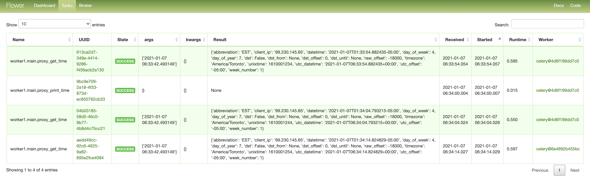
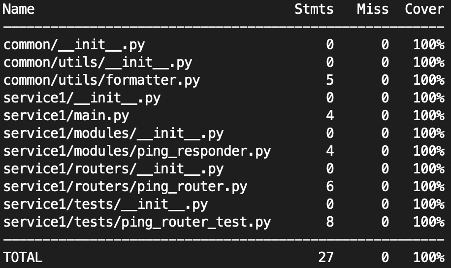
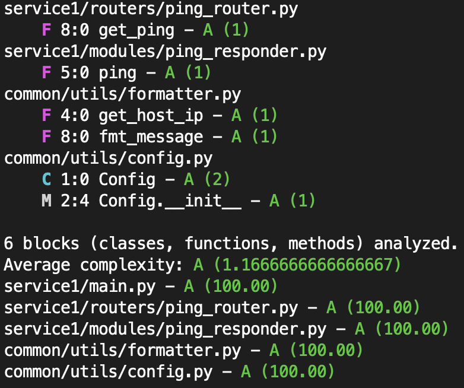
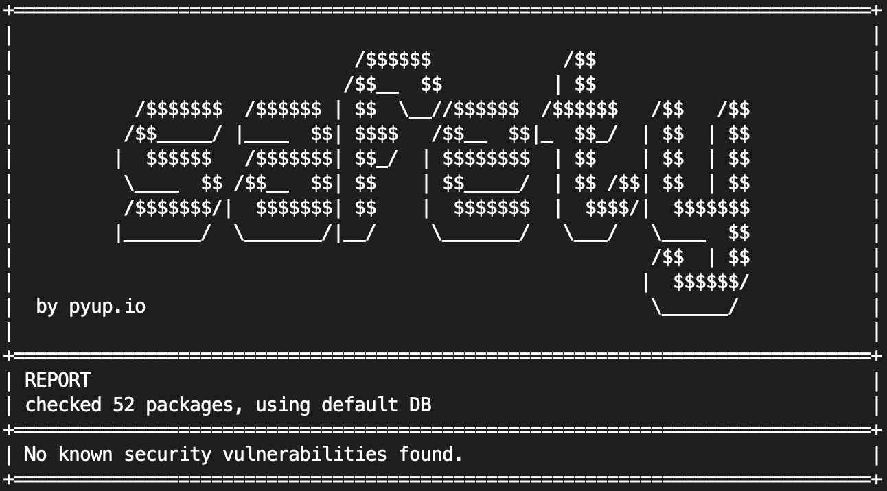
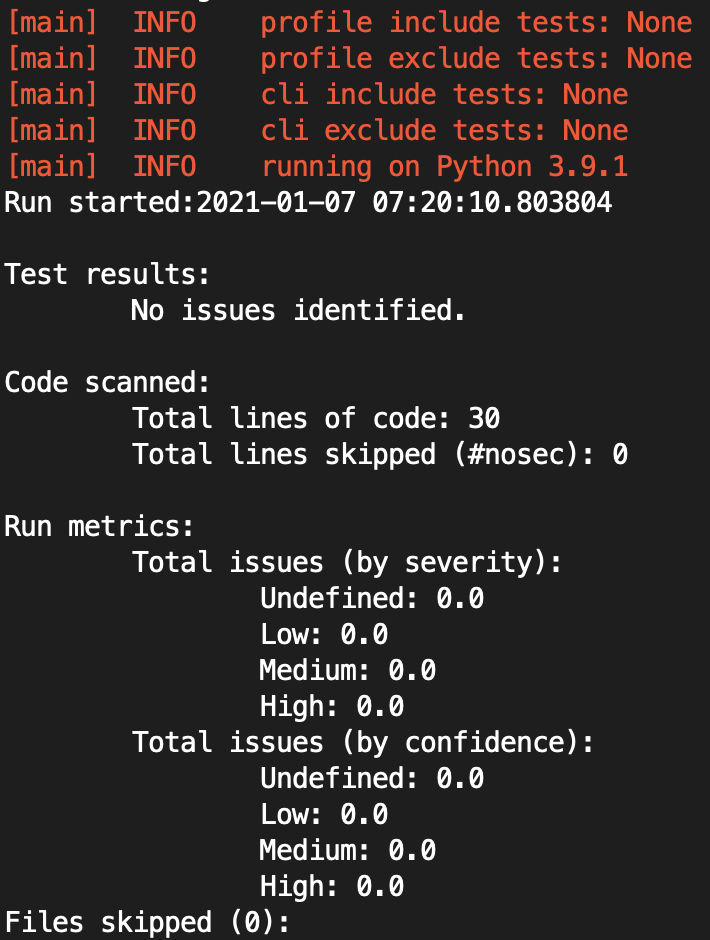

# Python Monorepo Sample Solution Template

This is a sample Python [monorepo](https://en.wikipedia.org/wiki/Monorepo) solution template with web/API focused projects labeled as `serviceN` and cronjob projects as `workerN`, but these names should be replaced with the actual meaningful project names. This repo uses a lot of patterns I explained at [An organizational and architectural foundation for sustainable AI engineering](https://medium.com/@tsaqib/an-organizational-and-architectural-foundation-for-sustainable-ai-engineering-18cf03998545).

Features implemented so far:

- Both services and workers share code from the `src/common` module
- Container-native concurrent solution, [everything is `docker-compose up` or `down`](#service1-run-locally-using-docker-compose)
- Docker images are built with lightweight and handy utilities (`nano`, `htop`, `gcc`, `make`)
- Docker [build artifacts are cached](#service1-production-build), so it won't download dependencies every time images are built
- Docker volume is mounted instead of copying over the source on development mode to reduce time
- Worker concurrency is controlled from outside via the standard `WEB_CONCURRENCY` environment variable
- Replicas of Service1 on production build are load-balanced by nginx at 8080
- Service1 uses [FastAPI](https://fastapi.tiangolo.com/), a very modern Python web/API framework
- Service1 has swagger in-built at:
  - http://localhost:8001/docs (on dev) and
  - http://localhost:8080/docs (on production)
- Service1 has [live reload](#service1-run-locally-live-reload) enabled (on dev), so every time you change code, the server reloads
- Service1 is [gunicorn](https://gunicorn.org/) powered but uses [Uvicorn](https://www.uvicorn.org/) workers which uses [libuv](https://github.com/libuv/libuv) (aspires to achieve Node.js-level perf)
- Service1 is [unit tested](#service1-unit-tests) using Python's [test framework](https://docs.python.org/3/library/unittest.html) and code [coverage](https://github.com/nedbat/coveragepy) is [measured on production build](#service1-code-coverage)
- [Statical analysis is performed](#service1-perform-statical-analysis) on Service1's code on production build
- Service1's [cyclomatic complexity and maintenance index](#service1-calculate-cyclomatic-complexity-and-maintenance-index) are calculated by using a simple command
- Worker1 uses [celery](https://docs.celeryproject.org/) as the worker manager backed by [redis](https://redis.io/)
- Worker1 stores all intermediate results of a long-running workflow in redis
- Worker1 uses the same cron format as unix's [cron](https://man7.org/linux/man-pages/man5/crontab.5.html)
- Worker1's worker load-balancing is managed by celery and fully configurable autoscale
- Worker1 uses Cooperative multitasking powered by [gevent](http://www.gevent.org/), aka. lighter than a conventional thread
- Worker1 elegantly maxes out hardware capacity:
  - Docker lets you distribute the containers across a cluster
  - Each container launches processes on all available cores configured and managed by celery
  - Each process takes advantage of Cooperative multitasking principles for long-running jobs
- The repo is checked against [known unsecure coding practices](#find-unsecure-coding-practice) on production build
- The entire repo's [package vulnerability report](#find-package-vulnerability) is generated on production build
- The repo's [deadcode (security concern)](#find-deadcode-security-concern) report is generated on production build
- The full repo is [easily formatted consistently](#consistent-code-formatting-across-colleagues) across machines/colleagues by a command
- All projects inside the solution are conveniently namespaced
- Modern Python 3.9 slim as the Docker base image
- Worker1 serves a beautiful dashboard for worker monitoring and debugging powered by [Flower](https://flower.readthedocs.io/) at http://localhost:5555

  

# Service1: Run locally (live reload)

```bash
cd /src/service1
virtualenv .
source bin/activate
pip install -r requirements.txt
cd /src
uvicorn service1.main:app --reload
```

# Service1: Run locally using docker-compose

Go to `/src` and execute the following:

```bash
docker-compose -f service1/docker-compose.dev.yml up --build
docker-compose -f service1/docker-compose.dev.yml down

# Full purge including remove pip packages (purge site-packages cache)
docker-compose -f service1/docker-compose.dev.yml down --rmi=local --remove-orphans -v
```

# Service1: Production build

Go to `/src` and execute the following:

```bash
docker-compose -f service1/docker-compose.prod.yml up --build
docker-compose -f service1/docker-compose.prod.yml down

# To remove pip packages (purge site-packages cache)
docker-compose -f service1/docker-compose.yml down --rmi=local --remove-orphans -v
```

# Service1: Unit tests

First, create a `virtualenv` for the respective project directory or centrally at `/` and then execute the following:

```bash
cd /src
python -m unittest discover -p "*_test.py"              # All tests in the repo
python -m unittest discover -p "*_test.py" -s service1  # Project specific
```

# Service1: Code coverage

Go to `/src` and execute the following:

```bash
coverage run -m unittest discover -p "*_test.py" -s service1
coverage report
```



# Service1: Perform statical analysis

Go to `/src` and execute the following:

```bash
mypy service1/main.py

# Success: no issues found in 8 source files
```

# Service1: Calculate cyclomatic complexity and maintenance index

```bash
radon cc -as service1/ common/
radon mi -s service1/ common/
```



# Find deadcode (security concern)

Go to `/src` and execute the following:

```bash
vulture service1/ --ignore-decorators "@router.*"

# service1/routers/fail_deadcode.py:7: unused function 'fail_it' (60% confidence)
```

# Find package vulnerability

Go to `/src` and execute the following:

```bash
safety check
```



# Find unsecure coding practice

Go to `/src` and execute the following:

```bash
bandit -r service1/ common/
```



# Consistent code formatting across colleagues

Go to `/src` and execute the following:

```bash
black common/ service1/ --exclude "/(bin|lib)/"
```
